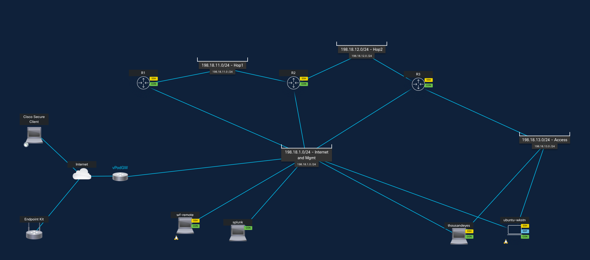

# LTRAI-1647: Agentic Ops with Cisco Workflows

Welcome to the **Agentic Operations with Cisco Workflows** lab for Cisco Live.

## Introduction

We will be using a virtual network topology in Cisco dCloud that generates events from Cisco infrastructure devices, through Splunk, and into Cisco Workflows. We'll also look at how we can use agents to troubleshoot from alerts from user experience tests such as with ThousandEyes.


## What is Agentic Operations?

Agentic Operations represents a paradigm shift in network management where AI-powered agents autonomously detect, analyze, and respond to network events without human intervention.

With workflow orchestration and integrations to your infrastructure and intelligent AI agents, you can start to leverage automation for fully closed-loop monitoring and response of infrastructure faults.


### Key Concepts
* **Event-Driven Automation:** The system reacts to events in real-time as they occur, instead of waiting for humans to pick up tickets or respond to reports of issues.
* **Closed-Loop Remediation:** The agent not only detects issues but can assess, diagnose, recommend next steps, take corrective action, and/or verify the resolution.
* **AI-Powered Analysis:** Cisco Workflows leverages AI to understand context and make intelligent decisions about remediation actions.


## Architecture and Topology

Components you will encounter in this lab:

* Cisco Workflows (in Meraki Dashboard)
* Cisco CSR100v virtual routers 
* Splunk
* ThousandEyes
* Large Language Model (LLM) integration (e.g. Claude Opus 4.5)

The topology we will use will look like this:


Networks used are:


* **ubuntu-wkstn** routes out through the 198.18.1x.x network, so we can use R2 as a traffic congestion point, if desired. This can also serve as a jumphost, if desired, to other devices on the mgmt network.
* **thousandeyes** agent sits on the access network, so it can run synthetic app user experience tests across the 182.18.1x.x network.
* **wf-remote** is a remote appliance that will register to Cisco Workflows, so that Cisco Workflows can talk back to these devices that sit in a restricted network (no inbound access).


### Quick reference
Key IP addresses for you to reference:

| Purpose        | Access                   | Password     |
| -------------- |--------------------------|--------------|
| R3-mgmt        | ssh cisco@198.18.1.103   | cisco        |
| thousandeyes   | https://198.18.1.202    | admin / welcome  |
| splunk         | http://198.18.1.210:8000 | admin / cisco        |
| wf-remote      | ssh root@198.18.1.204             | cisco        |
| jumphost       | ssh root@198.18.1.200   | cisco |

The event chain will ultimately be:
```txt
device -> [syslog] -> splunk -> [webhook] -> Cisco Workflows -> [agentic analysis] -> device
```

## Lab Flow

1. [**Lab 1** - Set up the network topology for faults to be send to Cisco Workflows and generate Webex notification](lab1)
2. **Lab 2** - Configure Cisco Workflows for automated response from the event generated in Lab 1.
3. **Lab 3** - Configure the Cisco Workflows agent for cognitive agentic response instead of static automation.
4. **Lab 4** - See how the agent can respond to ThousandEyes alerts on degraded user experience.
5. **Lab 5** - Integrate a custom tool into the agentic workflow.

