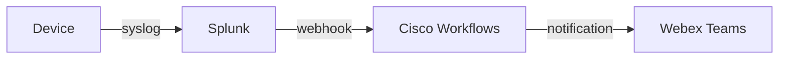
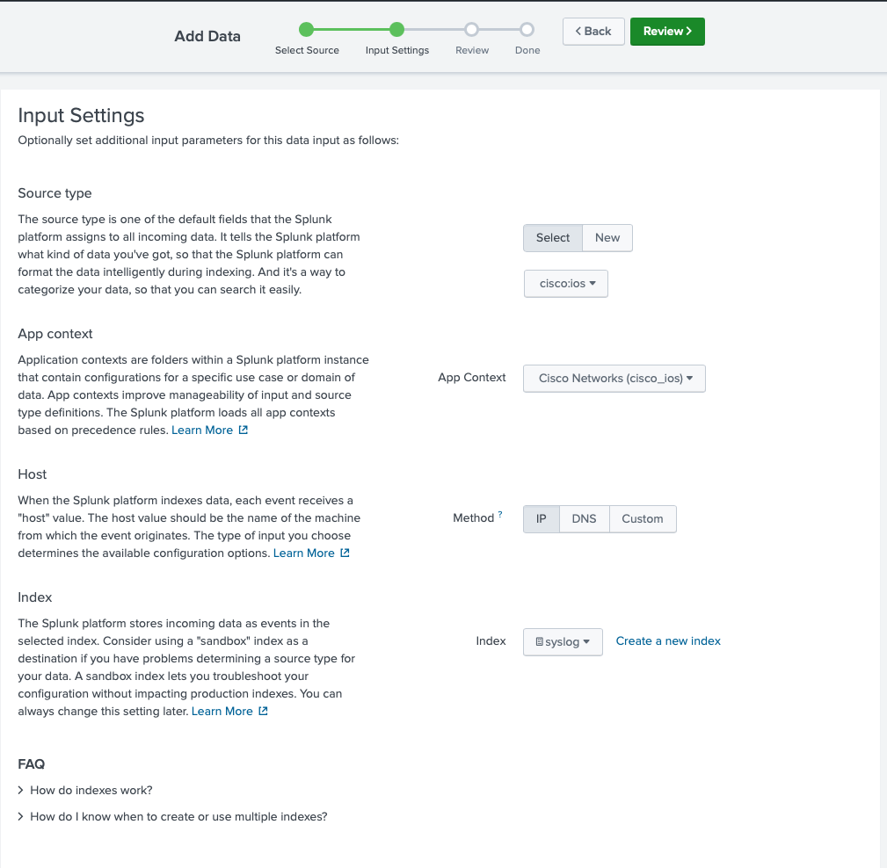
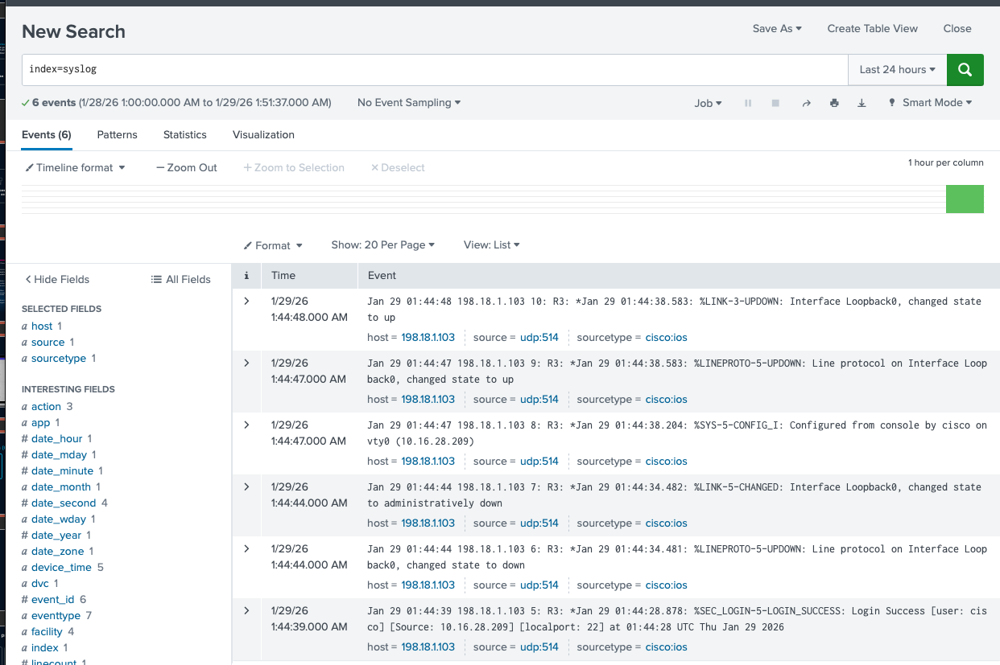
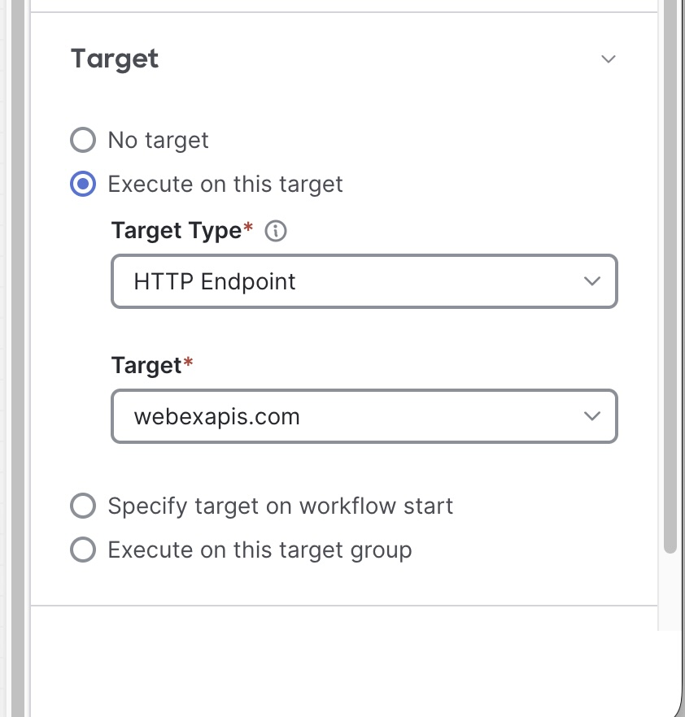
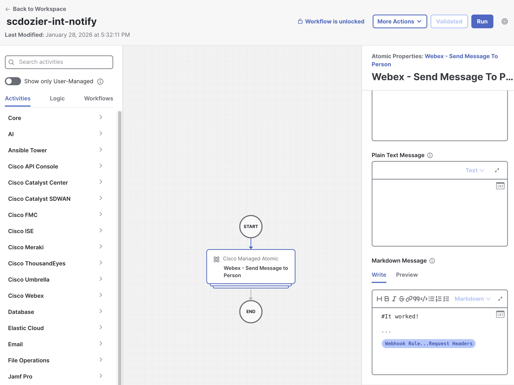
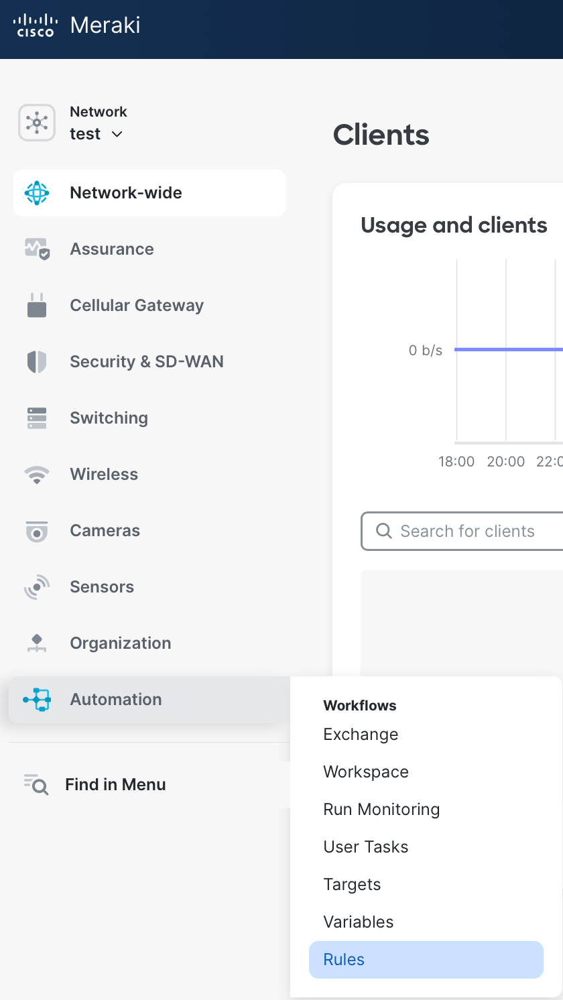
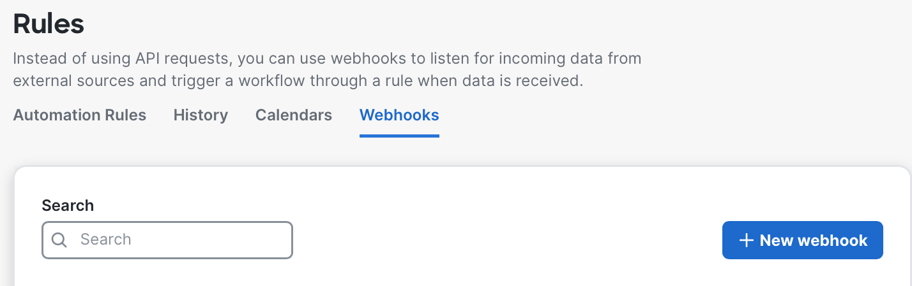
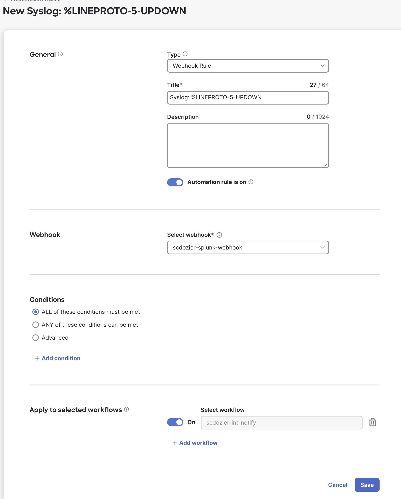

# Lab 1 - Setting up Network Topology

## Overview

In this lab, you will configure the foundational infrastructure required for agentic network operations.

By the end of this lab, you will have:

- Access to your dCloud lab environment
- Syslog forwarding from network device alerts to Splunk
- Splunk configured to trigger webhooks to Cisco Workflows on specific events
- Cisco Workflows configured with a workflow triggered by device events
- External tool integration with Cisco Workflows for Webex Teams notifications

This will serve as the detect & notify aspects of these labs.

The following diagram illustrates the event flow we are building:



---

## Step 1: Access Your Lab Environment

Your lab environment is hosted on Cisco dCloud and has been pre-provisioned for this session. You will access it through [https://lab-assistant.com/(https://lab-assistant.com/)], which provides instant access to running lab pods.

### 1.1 Checking out your personal Lab Pod

*This step has already been completed for you by your lab instructors at your station. If you prefer to use your personal laptop instead of the workstation in front of you, and have Cisco Secure Client and SSH installed, you can use your own laptop. If you choose to use your own device, let the instructor know and we will mark your station's pod number available so you can check the pod out from your personal laptop by following steps 1.1 and 1.2.*

1. Go to [https://lab-assistant.com/(https://lab-assistant.com/)] and enter the access code provided by your instructors.
2. The [documentation](https://cl-ltr.ciscolabs.com/0361f55971/) button is where your lab guide lies, which is this document that you may already be reading.
3. Check out a pod by clicking the [:: POD ::](https://lab-assistant.com/iltlab/) button, and selecting an available pod number from the list of <em class="lab-warning">Available Pods</em> shows in green.
4. *Note:* If performing this lab outside of a proctored Cisco Live! intructor led lab, your instructor should have shared a dCloud topology with your cisco.com account, and VPN details will instead be available in the dCloud session info.

### 1.2 Connecting to your Pod

*This step has already been completed for you already, unless you are choosing to use your personal laptop instead for managing the lab, or if your session becomes disconnected.*

1. In the <em class="lab-warning">Pod Details</em> section, you will see the VPN details. Clicking <em class="lab-warning">Connect VPN</em> should auto connect VPN, if you need to connect. You can also VPN to the defined VPN URL, and enter the VPN credentials available from this section.

### 1.3 Validating VPN connectivity

1. Validate your VPN connectivity to the lab pod. You should be on the <em class="example-input">198.18.1.x/24</em> network, which is our management network. Try to ping <em class="example-input">198.18.1.200</em> which should be successful.

---

## Step 2: Configure Router Syslog

In this step, you will configure router R3 to send syslog messages to Splunk. These syslog messages will be used to trigger automated workflows when interface state changes occur.

### 2.1 Connect to Router R3

1. Open <em class="lab-warning">PuTTY</em> or your favorite terminal from your workstation
2. SSH to router R3:

```sh
ssh cisco@198.18.1.103
Password: cisco
```

### 2.2 Configure Syslog

Enter configuration mode and apply the following configuration:

```cisco
enable
configure terminal

! Enable syslog at debugging level to capture interface events
logging trap debugging

! Include hostname in syslog messages for identification
logging origin-id hostname

! Set source interface to mgmt interface
logging source-interface GigabitEthernet3

! Configure Splunk as the syslog destination
logging host 198.18.1.210

! Optional: you may want to set the timestamps for logging and debugging:
service timestamps log datetime msec
service timestamps debug datetime msec 

end
write memory
```
    
### 2.3 Verify Syslog Configuration

```cisco
show logging
```

Confirm that:
- Logging trap level is set to <em class="lab-warning">debugging</em>
- Logging host <em class="example-input">198.18.1.210</em> is listed

You may optionally want to clear the log's boot messages to see new events easier.
```cisco
clear logging
<enter to confirm>
```

---

## Step 3: Setting up Splunk syslog ingestion

Now we need to get the syslog data from the router into splunk.

We must create a place for the syslog messages to be stored within Splunk. We will use an app to extend splunk to ingest Cisco syslog with [Add-on for Cisco Network Data](https://splunkbase.splunk.com/app/1467) which gives us the cisco:ios sourcetype for data parsing of syslog messages. This has been pre-installed in Splunk already for you. We have also pre-installed the [Cisco Networks](https://splunkbase.splunk.com/app/1352) app if you want to take advantage of syslog visualizations/trending from this data, but that is beyond the intent of this course.

We will store the syslog messages from our monitored routers into a special `syslog` index, so let's first create that index in splunk, to separate it from the other non-syslog data that may also be already coming into splunk.

### 3.1 Create a syslog index

1. In a web browser, login to [http://198.18.1.210:8000](http://198.18.1.210:8000) with <em class="example-input">admin / cisco</em>.
2. If Splunk isn't responding, ssh to 198.18.1.210 with `admin / cisco` and make sure that the splunk service is running with:

    ```bash
    cd /opt/splunk/bin
    sudo systemctl start splunk
   ```
    
4. Setup an index by going to: <em class="button-click">Settings > Data > Indexes</em>. Click the <em class="button-click">New</em> index button in the upper right corner.
5. Set the index <em class="lab-warning">name</em> to <em class="example-input">syslog</em> and the <em class="lab-warning">App</em> to <em class="example-input">Cisco Networks</em>
6. Click <em class="button-click">Submit</em>.

### 3.2 Setup splunk to listen to syslog

We need to ensure Splunk is listening for syslog traffic.

1. Go to <em class="button-click">Settings > Data > Data inputs > UDP</em>.
2. In upper right, click <em class="button-click">New Local UDP</em>. Configure the listener for UDP, port <em class="example-input">514</em>. Hit <em class="button-click">Next</em>.
3. Set the **source type** to `cisco:ios`. You will have to type this in manually, it is not available as a choice through the navigation tree in the pulldown.
4. Set the <em class="lab-warning">App context</em> to <em class="example-input">Cisco Networks</em>, <em class="lab-warning">Host method</em> as <em class="example-input">IP</em>, <em class="lab-warning">index</em> to <em class="example-input">syslog</em>.

    <figure markdown>
        { width="500" }
    </figure>
   
5. Click <em class="button-click">Review</em> and validate your configuration then click <em class="button-click">Submit</em>.

### 3.3 Optional syslog ingestion validation

1. If you want to validate that you are getting syslog messages into splunk, `ssh cisco@198.18.1.203`, and generate an interface down event.

    ```ios
    configure terminal
    interface Loopback0
    shut
    ! Wait threee seconds
    no shut
    ```

2. Browse to the [search and reporting](http://198.18.1.210:8000/en-US/app/cisco_ios/search) for the `Cisco Networks` app that the syslog messages are going to. **Apps > Cisco Networks** > Search
3. Type `index=syslog` into the search bar. You should see a few syslog events generated from that interface state change. If you don't, first ensure that you are in the correct App (Cisco Networks) for the search and that you setup the index and data inputs for the right app, as well.

    !!! tip "Tip"
        The configuration we have done so far gets the events into Splunk, but does not yet trigger any outbound webhooks to automation. Before we can set that up, we need to work backwards from Cisco Workflows and set some API keys up, so let's park our work in Splunk for a minute.
    
    <figure markdown>
      { width="500" }
    </figure>
    
    ---

## Step 4: Setting up a Webex API account

We need to setup a Webex API before we can build our workflow notification.

1. Sign up for an account at the [Webex Developer Portal](https://developer.webex.com/login) if you don't already have one.
2. In the upper right, click your photo/avatar, and choose <em class="button-click">My Webex apps</em> and then click <em class="button-click">Create a new app</em>.
3. Select <em class="button-click">Create a Bot</em> since we just need to send/receive messages.
4. Name your bot <em class="example-input">workflows-lab</em> and set the username to something globally unique across all Webex users like <em class="example-input">&lt;your_name&gt;-&lt;company_name&gt;-workflows-bot</em>. You must select an icon to submit. Choose one of the default robot icons, or feel free to upload a fun robot icon if you desire. Add a brief 10+ character description. Click <em class="button-click">Add bot</em>.
5. Copy your <em class="lab-warning">Bot access token</em> and <em class="lab-warning">Bot username</em> to a safe place.

### 4.1 Create a Webex Space for Notifications

Create a Webex space where the bot will send notifications. You will use this space throughout the remaining labs.

1. Open Webex (app or web at https://web.webex.com)
2. Click <em class="button-click">+</em> to create a new space
3. Name the space <em class="example-input">&lt;your_name&gt;-workflows-lab</em>
4. Add your bot to the space by typing its username (e.g., <em class="example-input">&lt;your_name&gt;-&lt;company_name&gt;-workflows-bot@webex.bot</em>)
5. Note the space name - you will use this in later labs for AI Agent notifications

---

## Step 5: Building a basic response workflow

Here we will first build a basic workflow to acknowledge that we can get an event to trigger a workflow. It won't do any troubleshooting/repair just yet.

### 5.1 Signing up for Meraki Dashboard

1. Sign up for an account at [meraki.cisco.com](https://account.meraki.com/login/new_account?r=EMEA) with your email address if you don't already have one. You will have to confirm the email invite, and then inut the MFA code in another email link to finish registration.
2. Login to [meraki.cisco.com](https://meraki.cisco.com).
3. If you get a dialog, click the <em class="lab-warning">Setup systems manager screen</em> and click <em class="example-input">Next</em>.
4. You will see an <em class="lab-warning">Automation</em> section in the left sidebar, which is where we will mostly spend our time. This is the Cisco Workflows app.

### 5.2 Setting the webex API key

1. In Workflows, go to <em class="button-click">Automation > Variables</em>. Click <em class="button-click">+New Variable</em>.
2. Name the key <em class="example-input">&lt;yourName&gt;-webex</em>, set <em class="lab-warning">String Type</em> to <em class="example-input">Secure String</em>, leave scope as <em class="example-input">Global</em> and put the Webex access token in the value. Click <em class="button-click">Save</em>.

### 5.3 Configuring a workflow

1. Go to <em class="button-click">Automation > Workspace</em>. Click the <em class="button-click">+Create</em> button in the upper right, and choose <em class="example-input">Workflow with Automation </em> since we will be attaching a webhook  to this workflow.
2. Name it <em class="example-input">&lt;your_name&gt;-notify</em> and click <em class="button-click">Continue</em>.
3. You will be given an empty canvas.
4. In the left panel are prebuilt modules you can use to call functions. Let's send a Webex message when we trigger an alert. In the left panel, navigate to <em class="button-click">Activities > Cisco Webex > Webex - Search for Room</em> and drag this activity box into the middle panel workspace canvas.
5. Click on the <em class="lab-warning">Webex - Search for Room</em> activity block. Set the <em class="lab-warning">Search Room Name</em> input to <em class="example-input">&lt;your_name&gt;-workflows-lab</em>.
6. For the <em class="lab-warning">Access Token</em>, click the  on the right of the text box and select your Webex API key variable.
7. Next, drag a <em class="button-click">Webex - Post Message to Room</em> activity block onto the canvas and connect it after the Search for Room block.
8. Click on the <em class="lab-warning">Webex - Post Message to Room</em> activity block and configure:
    - <em class="lab-warning">Access Token:</em> Click the  and select your Webex API key variable
    - <em class="lab-warning">Room ID:</em> Click the  and navigate to <em class="button-click">Activities > Webex - Search for Room > Room ID</em>
    - <em class="lab-warning">Markdown Message:</em> Enter <em class="example-input">## It Worked!</em> then press enter a few times, then click the  on the right and add the variable <em class="button-click">Webhook > Output > Request Headers</em>
    - This will take the JSON from the webhook and send it in a Webex Teams message
9. Configure the workflow target. Click off the activity back to the workflow canvas and scroll down to <em class="lab-warning">Target</em>. Since all activities in this workflow use the same target, we can set it once at the workflow level:
    - Select <em class="button-click">Execute on this target</em>
    - Click the <em class="button-click">+</em> to add a new target
    - Create an <em class="example-input">HTTP endpoint</em> with protocol of <em class="example-input">HTTPS</em>
    - Set <em class="lab-warning">host address</em> to <em class="example-input">webexapis.com</em>
    - Set <em class="lab-warning">No account keys</em> to <em class="example-input">True</em>
    - Check <em class="lab-warning">Disable server certification validation</em>
    - Click <em class="button-click">Save</em>

    <figure markdown>
      { width="600" }
    </figure>

10. You should now be able to click <em class="button-click">Validate</em>, and <em class="button-click">Run</em> in the upper right and receive a message in your Webex space.

    <figure markdown>
      { width="600" }
    </figure>

Yay, your first workflow has been created and tested!
 
---

## Step 6: Hooking the workflow up to a webhook

Now let's hook the webhook up, so we can trigger our test message from a device's syslog event.

### 6.1 Setting up a webhook in Cisco Workflows

1. Go to <em class="button-click">Automation > Rules</em> and then click the <em class="button-click">Webhooks</em> section in the header bar and click <em class="button-click">+ New webhook</em>.
 
    <figure markdown>
      { width="500" }
    </figure>
    <figure markdown>
      { width="500" }
    </figure>
    
2. Name the webhook <em class="example-input">&lt;your_name&gt;-splunk-webhook</em>. Keep the content type as <em class="example-input">application-json</em> and click <em class="button-click">Save</em>.
3. Click back into the webhook you just created. You should now see the <em class="lab-warning">Webhook API Key</em> and <em class="lab-warning">Webhook URL</em> populated. Grab the Webhook URL (which has the API key embedded in the URL query) and stash it in a local notepad--we will need to put them back in Splunk in a minute.

### 6.2 Setting up the Meraki automation 

1. Go to <em class="button-click">Automation > Rules > Add automation </em>
2. Set type to <em class="example-input">webhook </em> and title it <em class="example-input">Syslog: %LINEPROTO-5-UPDOWN</em>
3. Set the selected <em class="lab-warning">Webhook</em> to the webhook you just created.
4. Apply to the workflow you just created: <em class="example-input">&lt;your_name&gt;-notify</em> and click <em class="button-click">Save</em>.

    <figure markdown>
      { width="500" }
    </figure>

### 6.3 Finishing the Splunk webhook alert

Now we need to setup alerts for interesting syslog messages to trigger webhooks into Cisco Workflows for response.

We will create a saved search that triggers a webhook when matching syslog events are detected.

1. Go back to Splunk and navigate to <em class="button-click">Settings > KNOWLEDGE > Searches, reports and alerts</em>.
2. **IMPORTANT!** Make sure you change the <em class="lab-warning">App context</em> in the upper header to <em class="example-input">Cisco Networks</em> before creating the alert, so it associates to the right app's index.
3. Click <em class="button-click">New Alert</em> in the upper right.
4. Set the inputs to the following and save it:
    - <em class="lab-warning">Title:</em> <em class="example-input">%LINEPROTO-5-UPDOWN webhook</em>
    - <em class="lab-warning">Search:</em> <em class="example-input">index=syslog "%LINEPROTO-5-UPDOWN" "changed state to down"</em>
    - <em class="lab-warning">App:</em> <em class="example-input">Cisco Networks</em>
    - <em class="lab-warning">Alert type:</em> <em class="example-input">Real-time</em>
    - <em class="lab-warning">Trigger alert when:</em> <em class="example-input">Per-Result</em>
    - <em class="lab-warning">Expires:</em> <em class="example-input">1 second</em>
    - <em class="lab-warning">Trigger Actions:</em> <em class="example-input">Webhook</em>
5. In the Webhook configuration, paste your <em class="lab-warning">Webhook URL</em> from step 6.1.

    !!! tip "Troubleshooting Tip"
        You may want to also add a <em class="lab-warning">Trigger action</em> for <em class="example-input">Add to Triggered Alerts</em> so that you can verify the alert is triggering correctly by checking <em class="button-click">Activity > Triggered Alerts</em>. Alerts will not appear there unless this action is configured.
    
    !!! tip "Webhook Troubleshooting"
        To see if the syslog generated an alert, run the <em class="lab-warning">Run</em> from the <em class="lab-warning">Searches, Reports, and Alerts</em> page and change the search duration from <em class="button-click">Real-time</em> to <em class="button-click">Presets> All-time</em>. To troubleshoot webhook issues from within Cisco Workflows, go to <em class="button-click">Automation > Rules</em>, then click the <em class="button-click">History</em> tab to see incoming webhook requests and their status. This will tell you if the webhook is making it into Workflows from Splunk.

---

## Step 7: Testing the event triggering workflow

### 7.1 Shutdown an interface

We will test on R3 since that is the router where we configured syslog forwarding in Step 2.

1. You can generate a test syslog message by shutting down the loopback0

    ```cisco
    clear logging
    enable
    configure terminal
    interface Loopback0
    shutdown
    ```

This should produce a new log as seen in `show logging` with contents of `%LINEPROTO-5-UPDOWN`.


### 7.2 Validation

1. **Check Splunk for the syslog event:**
    - View the results of the [<em class="example-input">index=syslog "%LINEPROTO-5-UPDOWN"</em>](http://198.18.1.210:8000/en-US/app/search/search?q=search%20index%3Dsyslog%20%22%25LINEPROTO-5-UPDOWN%22) saved search from the <em class="button-click">Searches, Reports, and Alerts</em> page
    - Click <em class="button-click">Run</em> to execute the search
    - Change the search scope (right of search bar) from <em class="example-input">Real-time</em> to <em class="example-input">All-time</em> to see historical results
    - You may need to wait a couple minutes for the event to get picked up and indexed (typically ~60 seconds end-to-end)

2. **Check Cisco Workflows for the triggered workflow:**
    - If you see interface results in the saved search, go to Meraki Dashboard
    - Navigate to <em class="button-click">Automation > Run Monitoring</em> to see if your workflow ran
    - Click on the workflow run and select <em class="button-click">View run details</em> in the lower right
    - Click the <em class="lab-warning">Webex activity box</em> to see the payload of the syslog message that was sent to Webex

3. **Check Webex for the notification:**
    - You should have received a Webex message with JSON payload of the syslog event
    - Notice the extra info that the Cisco Networks app parses from the syslog format
    
    !!! warning "Troubleshooting"
        If you aren't seeing end-to-end notification, isolate where the messaging is not making it. Start at Splunk and troubleshoot within these logical areas:
    
        * **IOS syslog logging or Splunk data ingestion** - Is the syslog reaching Splunk?
        * **Search/reporting/webhook in Splunk** - Is the alert triggering? To help isolate, check Splunk's saved search to see if the syslog is picked up, and the <em class="button-click">Activity > Triggered Alerts</em> page to see if the webhook went out to Cisco Workflows.
        * **Workflows rule history** - Is the workflow being triggered? If you see the webhook with rule match count of None, Workflow got the webhook but didn't match a valid workflow to run. Check that your workflow doesn't have errors.

---

## Summary

You have successfully configured the foundational infrastructure for agentic network operations:

| Component | Status | Purpose |
|-----------|--------|---------|
| dCloud Lab | Connected | Provides isolated lab environment |
| Router Syslog | Configured | Sends interface events to Splunk |
| Splunk Webhook | Active | Triggers Cisco Workflows on interface down events |
| Cisco Workflows | Active | Workflow sends notification of event to Webex Teams |

In the next lab, you will configure the Cisco Workflows agent to analyze incoming events and take automated remediation actions, instead of just being notified.
