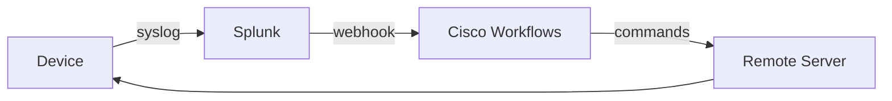
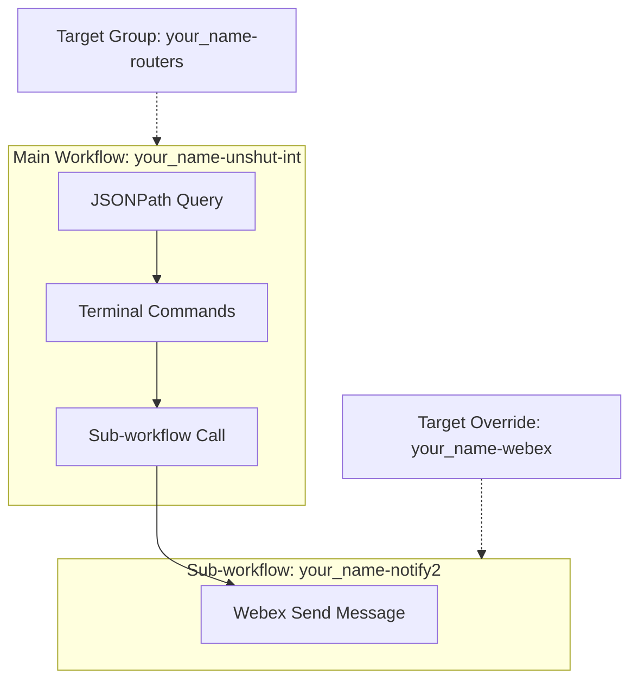
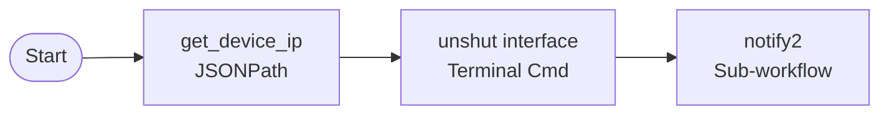
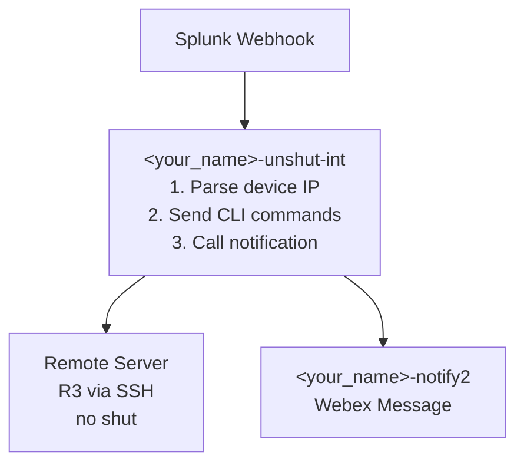

# Lab 2 - Using Cisco Workflows for automated response

## Overview

In this lab, you will build on the event handling and workflow created in Lab 1, by setting up an **Automation Remote** for Cisco Workflows to talk to your infrastructure through. An Automation Remote enables your workflows to communicate with resources inside your network that do not have access to the internet. Because many user-deployed devices are not exposed to the internet, Automation Remotes bridge the gap between those devices and the cloud so that they can be incorporated into your workflows. See the [Automation Remote documentation](https://documentation.meraki.com/Platform_Management/Workflows/Targets/Automation_Remote) for more details.

You will define a rule-based remediation workflow, allowing for autonomous closed-loop infrastructure operations.

By the end of this lab, you will:

- Be able to have Cisco Workflows talk to devices in your infrastructure.
- Configure static / rule-based workflows where you can automate defined response and remediation.

This will show one way to have automated response, before we bring in cognitive agentic response.

The following diagram illustrates the event flow we are building:



---

## Step 1: Registering a remote server to Workflows

1. Go to [meraki.cisco.com](https://meraki.cisco.com)
2. Browse to <em class="button-click">Automation > Targets > Remote Targets</em> click <em class="button-click">+ New Remote</em>.
3. Set the <em class="lab-warning">Display name</em> to <em class="example-input">&lt;your_name&gt;-remote</em> and click <em class="button-click">Save</em>.
4. Back on the <em class="lab-warning">Remote Targets</em> page, click the <em class="button-click">...</em> under <em class="lab-warning">Actions</em> and choose <em class="button-click">Connect</em>.
5. Click <em class="button-click">Generate Package</em> from the popup. This will generate and automatically download a file <em class="example-input">remotePackage.zip</em>.
6. Copy the file over to the wf-remote server (<em class="example-input">198.18.1.204</em>):
```sh
scp remotePackage.zip root@198.18.1.204:/root/
```
7. SSH to the wf-remote server and clone the lab repository:
```sh
ssh root@198.18.1.204
git clone https://github.com/ciscomanagedservices/ciscolive26_cw_ai_agents.git
```
8. Run the python script passing in the zip package to initiate the remote server registration procedure:
```sh
cd ciscolive26_cw_ai_agents/scripts/remote_server
./remote_register.py /root/remotePackage.zip
```
9. Wait a few seconds, and then refresh the Workflow's Targets page. You should see your remote move into a `Connected` status.

!!! note
    The official process for registering a remote server differs from this a bit. Cisco Workflows currently only supports remote servers running on virtual appliances where you can pass the initialization/registration text into an OVF template. Since dCloud doesn't support OVF templates, we feed the remotePackage into a python script that runs the same cloud init script that the OVF template would have triggered. For the full documentation on deploying a remote server, see the official [Cisco Workflows documentation](https://documentation.meraki.com/Platform_Management/Workflows/Targets/Automation_Remote/Remote_Setup_and_Deployment).

---

## Step 2: Configuring remote targets

### 2.1 Configuring R3 as a target

1. In <em class="button-click">Automation > Targets</em> go to <em class="button-click">+ New target</em> and set:
    - <em class="lab-warning">Target type:</em> <em class="example-input">Terminal endpoint</em>
    - <em class="lab-warning">Display name:</em> <em class="example-input">&lt;your_name&gt;-R3</em>
    - <em class="lab-warning">Remote Keys:</em> <em class="example-input">&lt;your_name&gt;-remote</em> (this specifies that this device should use the remote server to connect)
    - <em class="lab-warning">Protocol:</em> <em class="example-input">SSH</em>
    - <em class="lab-warning">Host/IP Address:</em> <em class="example-input">198.18.1.103</em>
    - <em class="lab-warning">Port:</em> <em class="example-input">22</em>
    - <em class="lab-warning">Prompt:</em> <em class="example-input">#</em>
2. Under <em class="lab-warning">Default Account Keys</em>, click the down arrow and say <em class="button-click">Add new</em> and specify:
    - <em class="lab-warning">Account Key Type</em>: <em class="example-input">Terminal password-based credentials</em>
    - <em class="lab-warning">Display Name</em>: <em class="example-input">&lt;your_name&gt;-R3-creds</em>
    - <em class="lab-warning">User name:</em> <em class="example-input">cisco</em>
    - <em class="lab-warning">Password:</em> <em class="example-input">cisco</em>
3. Ensure that the <em class="lab-warning">status</em> of the devices shows as <em class="example-input">Valid</em> which is ensuring a basic connection check to the device.

### 2.2 Create a Target group

Target groups contain the sets of devices that you can run the automation on. We want to create a group that would contain all possible devices that we'd run the automation on.

!!! info
    Target groups can only be associated at the workflow level, not at the per-activity level. The same target group needs to apply across all activities that need targets. So if we have a workflow with activities to multiple targets in the same workflow, they need to be in the same target group. There are two approaches here: a) Move the webex notification to a standalone workflow overriding the target to the webex URL, and call it with the **Workflows** activity; or b) Put both targets in a target group, and use the **override target condition** function to define a conditional that picks the appropriate target(s) from the aggregate target group list. This is overly complicated, so let's take Approach A.

1. Go to <em class="button-click">Automation > Targets > + New target group</em> and name it <em class="example-input">&lt;your_name&gt;-routers</em>.
2. Click <em class="button-click">+ Add target type</em> and choose the <em class="lab-warning">target type</em> of <em class="example-input">Terminal Endpoint</em>.
3. You could either implicitly add all targets you'd potentially run the automation on here, specify a matching condition, or you could enable the <em class="lab-warning">Include all targets of this type</em> if all terminal endpoints should get this workflow treatment. Since we are potentially dealing with other lab pods in the same tenant, let's just add our one device matching <em class="example-input">&lt;your_name&gt;-R3</em> into the target group. You could add your other pod routers in this group in the future, if you want.

---

## Step 3: Create Standalone Notification Workflow

In this step, you will convert your Lab 1 notification workflow into a reusable standalone workflow that can be called from other workflows. This is necessary because of the target group limitation described in Step 2.2.



### 3.1 Duplicate Your Lab 1 Notification Workflow

1. Go to <em class="button-click">Automation</em> → <em class="button-click">Workspace</em>
2. Find your workflow <em class="example-input">&lt;your_name&gt;-notify</em> from Lab 1
3. Click the <em class="button-click">...</em> menu on the workflow row
4. Select <em class="button-click">Duplicate</em>
5. A new workflow named <em class="example-input">Copy(1) &lt;your_name&gt;-notify</em> will be created

### 3.2 Configure the Duplicated Workflow

1. Click on the duplicated workflow <em class="example-input">Copy(1) &lt;your_name&gt;-notify</em> to open it in the editor
2. In the right-side panel, click the <em class="lab-warning">General</em> tab
3. Change the <em class="lab-warning">Display Name</em> to <em class="example-input">&lt;your_name&gt;-notify2</em>

### 3.3 Add an Input Variable for the Message

We need to make this workflow accept a message as input so other workflows can pass in custom messages.

1. In the right-side panel, click <em class="button-click">Variables</em> to expand the variables section
2. Click <em class="button-click">+ Add variable</em>
3. Configure the new variable using the [Variable Browser](https://documentation.meraki.com/Platform_Management/Workflows/Variables/Variable_Browser) (the puzzle piece icon allows you to select variables):
    - <em class="lab-warning">Data Type:</em> <em class="example-input">String</em>
    - <em class="lab-warning">Name:</em> <em class="example-input">message_body</em>
    - <em class="lab-warning">Scope:</em> <em class="example-input">Input</em>
    - Check <em class="lab-warning">Required for workflow to run</em>
    - <em class="lab-warning">Default Value:</em> <em class="example-input">-1</em> (this helps identify if it wasn't set properly)

### 3.4 Update the Webex Activity to Use the Input Variable

1. Click on the <em class="lab-warning">Send Webex Team Message</em> activity in the workflow canvas to select it
2. In the activity properties panel, find the <em class="lab-warning">Markdown Message</em> field
3. Clear the existing content
4. Click the variable reference icon  and navigate to: <em class="button-click">Workflow > Input > message_body</em>
5. This links the message content to whatever is passed into the workflow

### 3.5 Configure Target Override

Since this workflow will be called from another workflow that uses a different target group, we need to override the target.

1. With the <em class="lab-warning">Send Webex Team Message</em> activity still selected
2. In the <em class="lab-warning">Target</em> section, select <em class="button-click">Override workflow target</em>
3. Select your <em class="example-input">&lt;your_name&gt;-webex</em> target from Lab 1

### 3.6 Validate the Workflow

1. Click <em class="button-click">Validate</em> in the upper right corner
2. Ensure there are no validation errors
3. If validation passes, the workflow is ready to be called from other workflows

---

## Step 4: Create the Remediation Workflow

Now you will create the main workflow that parses the webhook, sends commands to the device, and calls the notification sub-workflow.

### 4.1 Create a New Workflow

1. Go to <em class="button-click">Automation</em> → <em class="button-click">Workspace</em>
2. Click <em class="button-click">+ New workflow</em>
3. Set the <em class="lab-warning">Display Name</em> to <em class="example-input">&lt;your_name&gt;-unshut-int</em>
4. Click <em class="button-click">Save</em> to create the workflow
5. The workflow editor will open with a <em class="lab-warning">Start</em> block

### 4.2 Configure the Workflow Target Group

Before adding activities, we need to configure the workflow to use our target group.

1. Click anywhere on the workflow canvas (not on any activity) to show the workflow properties
2. In the right-side panel, find the <em class="lab-warning">Target</em> section
3. Select <em class="button-click">Execute on this target group</em>
4. Select your <em class="example-input">&lt;your_name&gt;-routers</em> target group

### 4.3 Set a Placeholder Target Group Condition

We need to set a target group condition, but the actual condition depends on parsing the webhook (which happens after the workflow starts). So we'll set a placeholder that will never match, then override it in the activity.

1. Still in the workflow properties, under <em class="lab-warning">Target Group</em>
2. Choose <em class="lab-warning">Target Type:</em> <em class="example-input">Terminal Endpoint</em>
3. Click <em class="button-click">+ Add Condition</em> and configure:
    - <em class="lab-warning">Property:</em> Click the variable reference icon  and select <em class="button-click">Terminal Endpoint > Input > Host/IPAddress</em>
    - <em class="lab-warning">Comparison:</em> <em class="example-input">Equals</em>
    - <em class="lab-warning">Value:</em> <em class="example-input">-2</em>

!!! note
    This condition intentionally will never match any device. We set it to `-2` as a placeholder because the workflow requires some condition to pass validation. We will override this in the Terminal activity with the actual device IP parsed from the webhook.

### 4.4 Add JSONPath Query Activity (Parse Webhook)

Now we'll add an activity to extract the device IP from the webhook payload.

1. In the left panel, click <em class="button-click">Activities</em>
2. Search for <em class="example-input">JSONPath Query</em>
3. Drag the <em class="lab-warning">JSONPath Query</em> activity onto the canvas below the <em class="lab-warning">Start</em> block
4. Connect the <em class="lab-warning">Start</em> block to the <em class="lab-warning">JSONPath Query</em> activity (drag from Start's output to JSONPath's input)

### 4.5 Configure the JSONPath Query Activity

1. Click on the <em class="lab-warning">JSONPath Query</em> activity to select it
2. In the right-side panel, configure:
    - <em class="lab-warning">Display Name:</em> <em class="example-input">get_device_ip</em>
3. In the <em class="lab-warning">Source JSON to Query</em> field:
    - Click the variable reference icon  to open the [Variable Browser](https://documentation.meraki.com/Platform_Management/Workflows/Variables/Variable_Browser)
    - Navigate to: <em class="button-click">Rule > Webhook Rule > Output > Request Body</em>
4. Under <em class="lab-warning">JSONPath Queries</em>, click <em class="button-click">+ Add</em> and configure:
    - <em class="lab-warning">JSONPath Query:</em> <em class="example-input">$.result.dvc</em>
    - <em class="lab-warning">Property Name:</em> <em class="example-input">target_device</em>
    - <em class="lab-warning">Property Type:</em> <em class="example-input">String</em>

!!! info
    The JSONPath `$.result.dvc` extracts the device IP address from Splunk's webhook payload. The extracted value will be stored in a variable called `target_device` that we'll use to route commands to the correct device.

### 4.6 Add Terminal Commands Activity

1. In the left panel under <em class="button-click">Activities</em>, search for <em class="example-input">Terminal</em>
2. Drag the <em class="lab-warning">Execute Terminal Commands</em> activity below the JSONPath Query activity
3. Connect the <em class="lab-warning">JSONPath Query</em> output to the <em class="lab-warning">Execute Terminal Commands</em> input

### 4.7 Configure the Terminal Commands Activity

1. Click on the <em class="lab-warning">Execute Terminal Commands</em> activity to select it
2. Set the <em class="lab-warning">Display Name</em> to <em class="example-input">unshut interface</em>
3. In the <em class="lab-warning">Terminal > Input Commands</em> section, enter the following commands (one per line):
```cisco
conf t
int lo0
no sh
end
send log "Cisco Workflows has automated unshutting an interface."
```

### 4.8 Override the Target Group Condition

Now we'll override the placeholder target condition with the actual device IP from the webhook.

1. With the <em class="lab-warning">Execute Terminal Commands</em> activity still selected
2. In the <em class="lab-warning">Target</em> section, click <em class="button-click">Override target group condition</em>
3. Configure the override condition:
    - <em class="lab-warning">Target Type:</em> <em class="example-input">Terminal Endpoint</em>
    - <em class="lab-warning">Property:</em> Click the variable reference icon  and select <em class="button-click">Terminal Endpoint > Input > Host/IPAddress</em>
    - <em class="lab-warning">Comparison:</em> <em class="example-input">Equals</em>
    - <em class="lab-warning">Value:</em> Click the variable reference icon  and select <em class="button-click">Activities > get_device_ip > JSONPath Queries > target_device</em>

!!! success
    This override tells the workflow: "Instead of using the placeholder `-2` condition, match the device whose IP address equals the `target_device` value we parsed from the webhook."

### 4.9 Add the Notification Sub-Workflow

1. In the left panel, click <em class="button-click">Workflows</em> (not Activities)
2. Search for <em class="example-input">&lt;your_name&gt;-notify2</em>
3. Drag your <em class="lab-warning">&lt;your_name&gt;-notify2</em> workflow onto the canvas below the Terminal Commands activity
4. Connect the <em class="lab-warning">Execute Terminal Commands</em> output to the <em class="lab-warning">notify2</em> input

### 4.10 Configure the Notification Input

1. Click on the <em class="lab-warning">&lt;your_name&gt;-notify2</em> workflow block to select it
2. Find the <em class="lab-warning">message_body</em> input field
3. Click the variable reference icon  and navigate to: <em class="button-click">Activities > unshut interface > Response body</em>

!!! note
    This passes the terminal command output (showing what commands ran and their results) to the Webex notification. You could add additional text before/after this variable if you want more context in your notifications.

### 4.11 Validate the Complete Workflow

1. Click <em class="button-click">Validate</em> in the upper right corner
2. Ensure there are no validation errors
3. Fix any errors before proceeding

Your completed workflow should look like this:



---

## Step 5: Update the Trigger Rule

Now we need to update the webhook rule from Lab 1 to trigger our new remediation workflow instead of the simple notification workflow.

1. Go to <em class="button-click">Automation</em> → <em class="button-click">Rules</em>
2. Find and click on your webhook rule from Lab 1
3. In the <em class="lab-warning">Actions</em> section, change the <em class="lab-warning">Workflow</em> from your Lab 1 notification workflow to <em class="example-input">&lt;your_name&gt;-unshut-int</em>
4. Click <em class="button-click">Save</em>

---

## Step 6: Validation

### 6.1 Prepare R3 for Testing

1. SSH to R3:
   ```sh
   ssh cisco@198.18.1.103
   ```
2. Ensure the <em class="lab-warning">loopback0</em> interface is up:
   ```
   show ip int brief | include Loopback0
   ```
3. If up, clear the log to start fresh:
   ```
   clear log
   ```

### 6.2 Trigger the Event

1. Shut down the loopback0 interface:
   ```
   conf t
   int lo0
   shut
   ```

### 6.3 Monitor the Workflow

1. Wait approximately 90 seconds for Splunk to process the syslog and trigger the webhook
2. Go to <em class="button-click">Automation</em> → <em class="button-click">Workspace</em>
3. Find your <em class="example-input">&lt;your_name&gt;-unshut-int</em> workflow
4. Click <em class="button-click">... > View runs</em> to see workflow executions

### 6.4 Verify Success

1. Check R3 - the loopback0 interface should be back up:
   ```
   show ip int brief | include Loopback0
   ```
2. Check your Webex space for the notification with command output
3. Check the workflow run for successful completion of all activities

---

## Step 7: Troubleshooting

If the workflow doesn't run or fails:

1. **Webhook not firing:** Check Splunk search and alert configuration from Lab 1
2. **Workflow validation errors:** Review each activity's configuration and variable references
3. **Target not found:** Verify the target group contains your R3 device and the JSONPath correctly extracts the device IP
4. **Terminal commands fail:** Check that the remote server is connected and R3 credentials are correct
5. **Notification fails:** Verify the notify2 workflow's Webex target override is configured

To view detailed errors:

1. Go to <em class="button-click">Automation</em> → <em class="button-click">Workspace</em>
2. Click on your workflow
3. Click <em class="button-click">... > View runs</em>
4. Click on a failed run to see detailed error messages for each activity

---

## Summary

You have successfully configured automated remediation infrastructure:

| Component | Name | Purpose |
|-----------|------|---------|
| Remote Server | `<your_name>-remote` | Allows Workflows to send commands to on-prem devices |
| Terminal Target | `<your_name>-R3` | Device endpoint for SSH commands |
| Target Group | `<your_name>-routers` | Collection of devices for workflow targeting |
| Notification Workflow | `<your_name>-notify2` | Reusable sub-workflow for Webex notifications |
| Remediation Workflow | `<your_name>-unshut-int` | Main workflow: parse event → send commands → notify |

### What You Built



In the next lab, you will configure Cisco Workflows to have cognitive agentic intelligence, where it determines the next steps instead of you defining what commands to run. We will also leverage Cisco IQ's remote device connectivity (formerly known as CX RADKit) to simplify managing devices across the estate.
