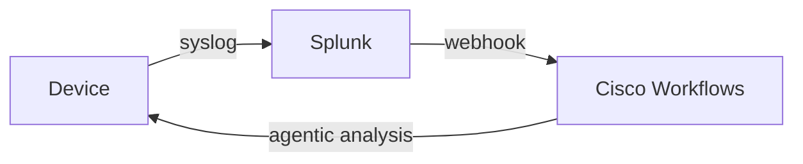
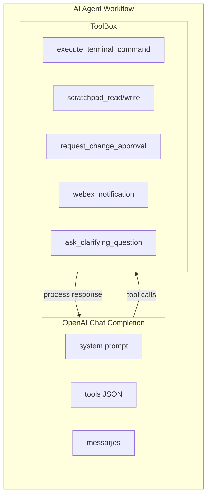
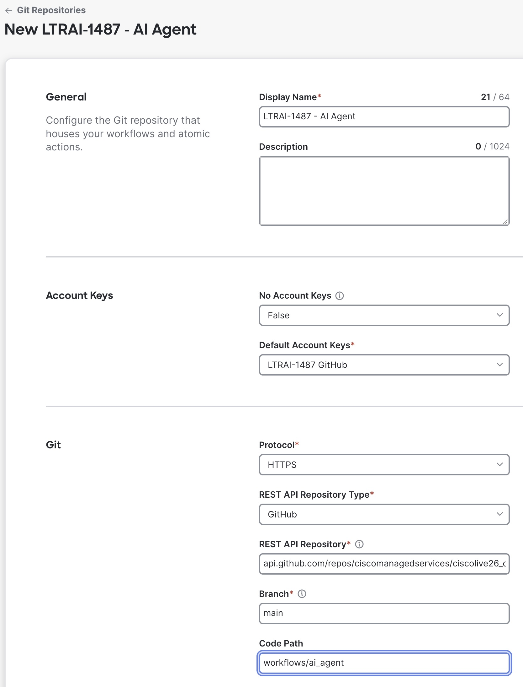
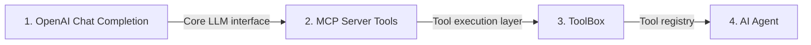
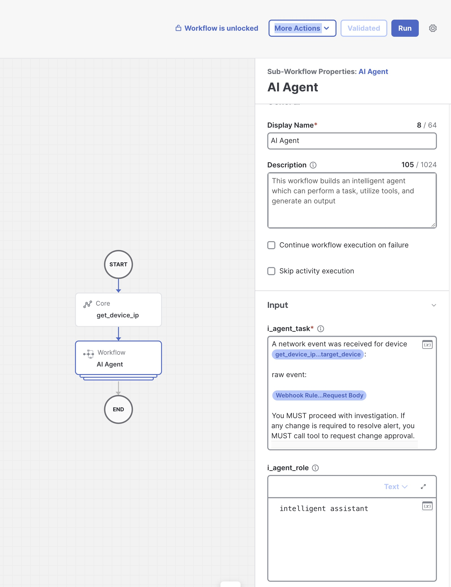

# Lab 3 - Creating a Cognitive AI Agent in Cisco Workflows

## Overview

In this lab, you will configure Cisco Workflows to act as an AI Agent that can respond, investigate, and remediate (with your approval) incoming events. By the end of this lab, you will have:

- Installed and configured RADKit Service for device management
- Set up the RADKit MCP Server for tool integration
- Imported the AI Agent workflow definitions from GitHub
- Configured OpenAI API credentials for LLM access
- Connected the AI Agent to your existing webhook trigger
- Tested the cognitive agentic response to a network event

The event flow remains the same as Lab 1, but now with cognitive analysis:



However, the agentic response will be a series of LLM calls which trigger tools (sub workflows) until work is completed.



---

## Step 1: Install RADKit Service

RADKit (Remote Access and Diagnostic Kit) provides secure remote access to network devices. We'll install it as a Docker container on the ubuntu-server.

### 1.1 Connect to the Ubuntu Server

1. From your workstation, SSH to the ubuntu-server:
   ```bash
   ssh root@198.18.1.250
   ```

### 1.2 Verify Pre-loaded Files

The RADKit service container and MCP server files are pre-loaded on the ubuntu-server.

1. Verify the pre-loaded files exist:
   ```bash
   ls -la /home/cisco/
   ```

!!! note "Pre-loaded Files"
    The following files are pre-loaded on the ubuntu-server in `/home/cisco/`:

    - `radkit-service.tar` - RADKit Docker image (already loaded)
    - `radkit-mcp-server-community/` - MCP server source code repository
    - `scripts/mcp/` - Setup scripts for this lab

2. If the RADKit service container is already running, you can skip to Step 2:
   ```bash
   docker ps | grep radkit
   ```

   If you see `radkit-service` in the output, proceed to **Step 2: Configure RADKit Service**.

3. If the container is not running but exists, try to start it:
   ```bash
   docker start radkit-service
   ```

### 1.3 Run the RADKit Installation Script (If Needed)

1. Run the installation script, specifying the pre-loaded tar file:
   ```bash
   ./radkit-install.sh -t /home/cisco/radkit-service.tar
   ```

2. When prompted for the superadmin password during bootstrap, enter:
   ```
   0e52nsq5jf7f-bxq8whdi7dnT
   ```

The script will:

- Load the RADKit Docker image
- Create a data directory at `/tmp/radkit`
- Bootstrap the RADKit service
- Start the container on port 8081

3. Verify the container is running:
   ```bash
   docker ps | grep radkit
   ```

---

## Step 2: Configure RADKit Service

Now we'll configure RADKit through its web interface to enroll with Cisco Cloud, add devices, and set up remote users.

### 2.1 Login to RADKit WebUI

1. Open a browser and navigate to: [https://198.18.1.250:8081/](https://198.18.1.250:8081/)
2. Accept the self-signed certificate warning
3. Login with:
    - <em class="lab-warning">Username:</em> <em class="example-input">superadmin</em>
    - <em class="lab-warning">Password:</em> <em class="example-input">0e52nsq5jf7f-bxq8whdi7dnT</em>

### 2.2 Enroll RADKit Service with SSO

1. Click <em class="button-click">Connectivity</em> in the left menu
2. Click <em class="button-click">Enroll with SSO</em>
3. Enter your <em class="lab-warning">email for Cisco ID</em>
4. Click <em class="button-click">Submit</em>
5. Click the <em class="button-click">CLICK HERE</em> link to complete SSO authentication
6. After SSO completes, close the SSO tab and return to the RADKit WebUI

!!! warning "Important"
    Note the <em class="lab-warning">Service ID</em> displayed at the top center of the screen (e.g., <em class="example-input">xxxx-yyyy-zzzz</em>). You will need this for MCP server setup in Step 3.

### 2.3 Add Network Devices

1. Click <em class="button-click">Devices</em> in the left menu
2. Click <em class="button-click">Add Device</em>
3. Add the following three devices:

| Name | IP Address | Device Type |
|------|------------|-------------|
| r1 | 198.18.1.101 | IOS XE |
| r2 | 198.18.1.102 | IOS XE |
| r3 | 198.18.1.103 | IOS XE |

For each device:

1. Enter the <em class="lab-warning">Name</em> and <em class="lab-warning">IP Address</em>
2. Select <em class="example-input">IOS XE</em> as the device type
3. Check <em class="lab-warning">Active (remotely manageable)</em>
4. Under <em class="lab-warning">Available Management Protocols</em>, click the checkbox for <em class="lab-warning">Terminal</em>
5. Scroll down to <em class="lab-warning">Terminal Settings</em>
6. Add SSH credentials:
    - <em class="lab-warning">Username:</em> <em class="example-input">cisco</em>
    - <em class="lab-warning">Password:</em> <em class="example-input">cisco</em>
7. Click <em class="button-click">Add & continue</em> (or <em class="button-click">Add & close</em> for the last device)

### 2.4 Add Remote Users

1. Click <em class="button-click">Remote Users</em> in the left menu
2. Click <em class="button-click">Add User</em>
3. Enter your <em class="lab-warning">email address</em>
4. Check <em class="lab-warning">Activate this user</em>
5. Click <em class="button-click">Add & close</em>

---

## Step 3: Setup RADKit MCP Server

The MCP (Model Context Protocol) server allows Cisco Workflows to interact with RADKit-managed devices through a standardized API.

!!! note "About MCP"
    We will be setting up an MCP server that acts as an intermediary for Cisco Workflows to send JSON RPC requests over HTTP to the MCP server, which then runs commands in the RADKit SDK. MCP is explained in more detail here: [What is Model Context Protocol (MCP) Explained](https://composio.dev/blog/what-is-model-context-protocol-mcp-explained)

### 3.1 Update the RADKit MCP Server Repository

The RADKit MCP server source code is pre-loaded in `/home/cisco/` and maintained in a community repository on GitHub.

1. On the ubuntu-server (still connected via SSH), update the MCP server repository to get the latest version:
   ```bash
   cd /home/cisco/radkit-mcp-server-community
   git pull
   ```

   > **Note:** If the directory doesn't exist, clone it:
   > ```bash
   > cd /home/cisco
   > git clone https://github.com/CiscoDevNet/radkit-mcp-server-community
   > ```

### 3.2 Copy Setup Scripts

1. Copy the setup scripts from the pre-loaded scripts directory to the MCP server directory:
   ```bash
   cp /home/cisco/scripts/mcp/setup_mcp.sh .
   cp /home/cisco/scripts/mcp/enroll_client.py .
   chmod +x setup_mcp.sh enroll_client.py
   ```

   > **Note:** You should still be in the `/home/cisco/radkit-mcp-server-community` directory from Step 3.1.

### 3.3 Install RADKit Client

Before running the setup script, you must install the RADKit client Python package:

1. Install the RADKit client from PyPI:
   ```bash
   python3 -m pip install cisco_radkit_client==1.9.2 --break-system-packages
   ```

   > **Note:** The `--break-system-packages` flag is required on Ubuntu 24.04 due to PEP 668 externally-managed environment restrictions.

### 3.4 Enroll RADKit Client Certificates

The enrollment process authenticates you with RADKit cloud and generates client certificates.

1. Run the enrollment script:
   ```bash
   python3 enroll_client.py
   ```

2. When prompted, enter your <em class="lab-warning">Cisco email address</em> (same one used in Step 2.2)

3. **IMPORTANT:** The script will display a URL like this:
   ```
   https://id.cisco.com/oauth2/default/v1/authorize?response_type=code&client_id=radkit_prod...
   ```

!!! warning "Action Required"
    You **MUST** copy this URL and paste it into your browser to complete OAuth authentication. The script will wait for you to complete the login.

4. After completing OAuth in your browser, return to the terminal

5. When prompted for a <em class="lab-warning">private key password</em>, enter:
   ```
   0e52nsq5jf7f-bxq8whdi7dnT
   ```

   > **Note:** This password is hardcoded in the setup script to simplify the lab. In production, you would use a unique, strong password.

6. Confirm the password when prompted

!!! info "More Information"
    For detailed information about setting up the MCP server outside of this lab, see the official documentation at [https://github.com/CiscoDevNet/radkit-mcp-server-community](https://github.com/CiscoDevNet/radkit-mcp-server-community)

### 3.5 Run the MCP Setup Script

Now run the setup script to build and start the MCP server container:

1. Run the setup script:
   ```bash
   ./setup_mcp.sh
   ```

2. When prompted, enter:
    - Your <em class="lab-warning">email address</em> (the same one used for RADKit registration)
    - Your <em class="lab-warning">RADKit Service Serial</em> (the Service ID from Step 2.2, e.g., <em class="example-input">xxxx-yyyy-zzzz</em>)

The script will:

- Check DNS configuration and fix if needed
- Verify your RADKit enrollment
- Create a Docker network for RADKit communication
- Build the MCP server Docker image
- Start the MCP server container on port 8000

!!! tip "Re-running the Script"
    The script is designed to be idempotent. If you need to re-run it (e.g., after fixing an error), it will clean up existing resources automatically.

### 3.6 Verify MCP Server

1. Run the test script to verify the MCP server is working:
   ```bash
   bash /home/cisco/scripts/mcp/radkit-mcp-test.sh
   ```

2. Verify all tests show <em class="button-click">[OK]</em>:
    - Test 1: Initialize MCP Session
    - Test 2: List Available Tools
    - Test 3: Call Tool

!!! success "Success Criteria"
    All three tests should pass. The MCP endpoint is now available at: `http://198.18.1.250:8000/mcp`

---

## Step 4: Import the Cognitive Response Workflows

We will need to import the cognitive response workflow definitions from GitHub into your Cisco Workflows instance.

### 4.1 Add Git Repository to Cisco Workflows

1. Go to Meraki Dashboard on your workstation
2. Go to <em class="button-click">Automation</em> -> <em class="button-click">Workspace</em>
3. On the right, click the <em class="button-click">Actions</em> button and then <em class="button-click">Manage Git Repositories</em>
4. Click <em class="button-click">New git repository</em>
5. Fill the repository details:
    - <em class="lab-warning">Display Name:</em> <em class="example-input">LTRAI-1487 - AI Agent</em>
    - Click <em class="button-click">Default Account Keys</em> -> <em class="button-click">Add New</em>
        - <em class="lab-warning">Account Key Type:</em> <em class="example-input">Git Token-Based Credentials</em>
        - <em class="lab-warning">Display Name:</em> <em class="example-input">LTRAI-1487 GitHub</em>
        - <em class="lab-warning">Token:</em> Use the GitHub token provided by your administrator (found in the lab-assistant.com lab details)
    - <em class="lab-warning">REST API Repository:</em> <em class="example-input">api.github.com/repos/ciscomanagedservices/ciscolive26_cw_ai_agents</em>
    - <em class="lab-warning">Branch:</em> <em class="example-input">main</em>
    - <em class="lab-warning">Code Path:</em> <em class="example-input">workflows/ai_agent</em>
6. Click <em class="button-click">Save</em>

<figure markdown>
  { width="500" }
</figure>

### 4.2 Import Workflows

You will now import workflows from the Git repository. Follow the steps below in order, as some workflows depend on others.

!!! note
    When importing workflows, you may be prompted for credentials or API keys. Keep your Webex access token from Lab 1 handy.

!!! info "About Atomic Workflows"
    The <em class="example-input">OpenAIChatCompletion</em>, <em class="example-input">MCPListTools</em>, and <em class="example-input">MCPRunTool</em> workflows are Atomic workflows. Atomic workflows are immutable, reusable workflow components found in the Activities panel or in the 'Atomics' section of workspace. See the [Atomic Actions documentation](https://documentation.meraki.com/Platform_Management/Workflows/Workflows/Atomic_Actions) for more details.

#### Import Order Overview



#### 4.2.1 Import OpenAI Chat Completion

1. Go to <em class="button-click">Automation</em> -> <em class="button-click">Workspace</em>
2. Click <em class="button-click">Actions</em> -> <em class="button-click">Import Workflow</em>, then click the <em class="button-click">Git</em> tab
3. Select the following:
    - <em class="lab-warning">Repository:</em> <em class="example-input">LTRAI-1487 - AI Agent</em>
    - <em class="lab-warning">Workflow:</em> <em class="example-input">OpenAIChatCompletion</em>
    - <em class="lab-warning">Version:</em> Latest
4. Click <em class="button-click">Import</em>
5. When prompted for <em class="lab-warning">i_api_key</em>:
    - Enter your lab OpenAI API key
    - **Ask your instructor for this key if you don't have it**
6. Click <em class="button-click">Import</em>

#### 4.2.2 Import MCP Server Tools

1. Click <em class="button-click">Actions</em> -> <em class="button-click">Import Workflow</em>, then click the <em class="button-click">Git</em> tab
2. Import <em class="example-input">MCPListTools</em>:
    - <em class="lab-warning">Repository:</em> <em class="example-input">LTRAI-1487 - AI Agent</em>
    - <em class="lab-warning">Workflow:</em> <em class="example-input">MCPListTools</em>
    - <em class="lab-warning">Version:</em> Latest
    - Click <em class="button-click">Import</em>
3. Import <em class="example-input">MCPRunTool</em>:
    - <em class="lab-warning">Repository:</em> <em class="example-input">LTRAI-1487 - AI Agent</em>
    - <em class="lab-warning">Workflow:</em> <em class="example-input">MCPRunTool</em>
    - <em class="lab-warning">Version:</em> Latest
    - Click <em class="button-click">Import</em>

#### 4.2.3 Import ToolSendWebexNotification

1. Click <em class="button-click">Actions</em> -> <em class="button-click">Import Workflow</em> -> <em class="button-click">Git</em> tab
2. Select the following:
    - <em class="lab-warning">Repository:</em> <em class="example-input">LTRAI-1487 - AI Agent</em>
    - <em class="lab-warning">Workflow:</em> <em class="example-input">ToolSendWebexNotification</em>
    - <em class="lab-warning">Version:</em> Latest
3. Click <em class="button-click">Import</em>
4. When prompted for the <em class="lab-warning">Webex Access Token</em> variable, enter the Webex Access Token you created in Lab 1

#### 4.2.4 Import ToolBox

The ToolBox workflow includes all tool subworkflows as embedded components, so you only need to import this single workflow to get all the tools.

1. Click <em class="button-click">Actions</em> -> <em class="button-click">Import Workflow</em> -> <em class="button-click">Git</em> tab
2. Select the following:
    - <em class="lab-warning">Repository:</em> <em class="example-input">LTRAI-1487 - AI Agent</em>
    - <em class="lab-warning">Workflow:</em> <em class="example-input">ToolBox</em>
    - <em class="lab-warning">Version:</em> Latest
3. Click <em class="button-click">Import</em>

!!! warning
    You will see a warning about a missing remote connection. This is expected - we will fix this after all imports are complete.

!!! note
    The ToolBox workflow bundles all individual tools (scratchpad, Webex notifications, change approval, terminal commands, and RADKIT tools) as subworkflows. You do not need to import them separately.

#### 4.2.5 Import AI Agent

1. Click <em class="button-click">Actions</em> -> <em class="button-click">Import Workflow</em> -> <em class="button-click">Git</em> tab
2. Select the following:
    - <em class="lab-warning">Repository:</em> <em class="example-input">LTRAI-1487 - AI Agent</em>
    - <em class="lab-warning">Workflow:</em> <em class="example-input">AIAgent</em>
    - <em class="lab-warning">Version:</em> Latest
3. Click <em class="button-click">Import</em>

!!! warning
    You will see a warning about a missing remote connection. This is expected - we will fix this in the next step.

#### 4.2.6 Validate All Workflows

After importing all workflows, validate that they are configured correctly:

1. Go to <em class="button-click">Automation</em> -> <em class="button-click">Workspace</em>
2. For each imported workflow:
    - Click on the workflow name to open it
    - Click <em class="button-click">Validate</em> in the upper right corner
    - Ensure there are no validation errors
3. If you see any errors, check that all required credentials were entered correctly

You should have imported a total of **6 workflows**:

- OpenAIChatCompletion
- MCPListTools
- MCPRunTool
- ToolSendWebexNotification
- ToolBox
- AIAgent

#### 4.2.7 Verify OpenAI Endpoint Configuration

1. Go to <em class="button-click">Automation</em> -> <em class="button-click">Targets</em>
2. Click on <em class="button-click">OPENAI_ENDPOINT</em>
3. Verify the following settings:
    - <em class="lab-warning">Host:</em> <em class="example-input">ciscolive-llm.com</em>
    - <em class="lab-warning">Port:</em> <em class="example-input">443</em>
    - <em class="lab-warning">Path:</em> (leave blank)
4. If any settings are incorrect, update them and click <em class="button-click">Save</em>

#### 4.2.8 Configure Variables and Targets

After importing the workflows, we need to configure the variables and targets properly.

1. Go to <em class="button-click">Automation > Variables</em> and click on <em class="example-input">OPENAI_API_KEY</em>. Set it to the API key found in the dCloud pod information. If you can't find it, ask the instructor.
2. Go to <em class="button-click">Automation > Variables</em> and click on <em class="example-input">Webex Access Token</em>. Make sure it is set to the Webex Access Token you created in Lab 1.
3. Go to <em class="button-click">Automation > Targets</em> and click on <em class="example-input">RADKit MCP - Lab</em>. Set the <em class="lab-warning">Remote Keys</em> to your Automation Remote you configured earlier.

    !!! warning
        If you forget to set the Remote Keys, your requests will go out over the internet instead of through your Automation Remote to the MCP Server which talks to the RADKit server.

### 4.3 Test Individual Tools

Before testing the full AI Agent, let's verify that the individual tools work correctly.

#### 4.3.1 Test RADKit Exec Command Tool

1. Go to <em class="button-click">Automation</em> -> <em class="button-click">Workspace</em>
2. Click on <em class="button-click">Tool - RADKIT Exec Command</em> to open the workflow
3. Click <em class="button-click">Run</em> in the upper right corner
4. When prompted, fill out the input variables:
    - <em class="lab-warning">i_device_name:</em> <em class="example-input">r1</em>
    - <em class="lab-warning">i_commands:</em> <em class="example-input">show version</em>
5. Click <em class="button-click">Run</em> to execute the workflow
6. Verify the workflow completes successfully and returns the device output

!!! success "Success Criteria"
    The workflow should complete without errors and display the `show version` output from device r1.

#### 4.3.2 Test Webex Notification Tool

1. Go to <em class="button-click">Automation</em> -> <em class="button-click">Workspace</em>
2. Click on <em class="button-click">Tool - Send Webex Notification</em> to open the workflow
3. On the right side panel, expand <em class="lab-warning">Variables</em>
4. Update the local variable <em class="lab-warning">l_room_name</em> to the name of the Webex space you created in Lab 1 (e.g., <em class="example-input">&lt;your_name&gt;-workflows-lab</em>)
5. Verify the local variable <em class="lab-warning">l_meraki_dashboard_url</em> matches your Cisco Workflows URL prefix. Look at your browser's address bar - the URL should start with something like <em class="example-input">https://n219.dashboard.meraki.com/o/XXXXXX/</em>. If the variable value doesn't match your URL prefix, update it accordingly.

!!! note
    The <em class="lab-warning">l_meraki_dashboard_url</em> variable is used to generate clickable links in Webex notifications that take you directly to the workflow run. If this doesn't match your environment, the links in notifications won't work correctly.

6. Click <em class="button-click">Run</em> in the upper right corner
7. When prompted, fill out the input variables:
    - <em class="lab-warning">i_instance_id:</em> <em class="example-input">test</em>
    - <em class="lab-warning">i_message:</em> <em class="example-input">Hello from the AI Agent lab! This is a test notification.</em>
8. Click <em class="button-click">Run</em> to execute the workflow
9. Check your Webex space to verify you received the message

!!! success "Success Criteria"
    You should see your test message appear in your Webex space from Lab 1.

### 4.4 Test the AI Agent

Now let's verify the full AI Agent workflow runs correctly.

1. Go to <em class="button-click">Automation</em> -> <em class="button-click">Workspace</em>
2. Click on <em class="button-click">AIAgent</em> to open the workflow
3. Click <em class="button-click">Run</em> in the upper right corner
4. When prompted, fill out the input variables:
    - <em class="lab-warning">i_agent_task:</em> <em class="example-input">Go to r1, get the current time and interfaces which are up. Output these results exactly to webex and include a short summary.</em>
5. Click <em class="button-click">Run</em> to execute the workflow
6. Monitor the workflow execution and verify it completes without errors
7. Check your Webex space to confirm the agent sent the results

!!! success "Success Criteria"
    The workflow should complete successfully, and you should receive a Webex message containing the device time, interface status, and a summary from the AI Agent.

!!! bug "Troubleshooting"
    If the workflow fails:

    - Verify the OPENAI_API_KEY is set correctly
    - Check that the OPENAI_ENDPOINT target is configured properly
    - Ensure your Webex access token is valid
    - Re-run the individual tool tests (4.3.1 and 4.3.2) to isolate the issue

---

## Step 5: Create AI Agent Workflow for Event Remediation

Now that you have the AI Agent working, let's connect it to respond to the same network event from Lab 2. Instead of hardcoded commands, the AI Agent will cognitively analyze the event and determine the appropriate remediation.

### 5.1 Duplicate the Lab 2 Workflow

We'll start by duplicating your Lab 2 workflow and modifying it to use the AI Agent.

1. Go to <em class="button-click">Automation</em> → <em class="button-click">Workspace</em>
2. Find your workflow <em class="example-input">&lt;your_name&gt;-unshut-int</em> from Lab 2
3. Click the <em class="button-click">...</em> menu on the workflow and select <em class="button-click">Duplicate</em>

### 5.2 Configure the New Workflow

1. Click on the duplicated workflow <em class="example-input">Copy(1) &lt;your_name&gt;-unshut-int</em> to open it
2. In the <em class="lab-warning">General</em> tab, rename the workflow to <em class="example-input">&lt;your_name&gt;-ai-fix-shut-interface</em>
3. Delete the <em class="lab-warning">Terminal</em> activity (the static remediation commands)
4. Delete the <em class="lab-warning">Webex notification</em> activity that was added in Lab 2

### 5.3 Add the AI Agent Activity

1. On the left side panel, click <em class="button-click">Workflows</em>
2. Search for <em class="example-input">AI Agent</em>
3. Drag the <em class="lab-warning">AIAgent</em> workflow into the flow after the <em class="lab-warning">JSON Path Query</em> activity

### 5.4 Configure the AI Agent Task

1. Click on the <em class="lab-warning">AI Agent</em> block to select it
2. Expand the <em class="lab-warning">i_agent_task</em> input variable
3. Configure it with the following text, replacing the placeholders with reference variables from the Variable Browser:

```
A network event was received for device {target_device}:

raw event:

{webhook_request_body}

You MUST proceed with investigation. If any change is required to resolve alert, you MUST call tool to request change approval.
```

Replace the placeholders as follows:

- <em class="example-input">{target_device}</em> → Click the variable reference icon  and select <em class="button-click">Activities > get_device_ip > JSONPath Queries > target_device</em>
- <em class="example-input">{webhook_request_body}</em> → Click the variable reference icon  and select <em class="button-click">Rule > Webhook Rule > Output > Request Body</em>

!!! note
    We're keeping it simple - giving the agent minimal parsing and letting it analyze the raw event. The final instruction ensures the agent requests your approval before making any changes.

<figure markdown>
  { width="600" }
</figure>

### 5.5 Validate the Workflow

1. Click <em class="button-click">Validate</em> in the upper right corner
2. Ensure there are no validation errors
3. If errors appear, verify the reference variables are correctly linked

### 5.6 Update the Trigger Rule

1. Go to <em class="button-click">Automation</em> → <em class="button-click">Rules</em>
2. Find your rule from Lab 1
3. <em class="button-click">Enable</em> the action for the new <em class="example-input">&lt;your_name&gt;-ai-fix-shut-interface</em> workflow
4. <em class="button-click">Disable</em> the action for the prior <em class="example-input">&lt;your_name&gt;-unshut-int</em> workflow

### 5.7 Test the AI Agent Response

1. SSH to R3 (198.18.1.103)
2. Execute the following commands to shut down the interface:
   ```
   conf t
   int lo0
   shut
   ```
3. Wait for the webhook to fire and observe the AI Agent workflow execution

### 5.8 Respond to Clarifying Questions (If Any)

The AI Agent may ask clarifying questions before proceeding - that's OK! It's just trying to make sure it's doing the right thing.

1. Check Webex for any <em class="lab-warning">clarifying questions</em> from the agent
2. If the agent asks a question, click the <em class="button-click">Cisco Workflow Run</em> link in the Webex message
3. In the Cisco Workflows UI, click <em class="button-click">View Task</em>
4. Provide as much detail as possible to help the agent understand the situation:
    - Confirm the interface should be brought back up
    - Specify that this is a loopback interface on R3
    - Indicate that the interface was administratively shut down and needs to be restored
    - Note: The AI Agent may think that the loopback should be left down, so it will want to confirm with you before opening a change request

!!! tip
    The more context you provide, the better the agent can proceed with confidence and open a change request!

### 5.9 Approve the Change Request

Once the agent has enough information, it will request your approval before making changes:

1. Check Webex for a <em class="lab-warning">change approval notification</em> from the agent
2. Click the <em class="button-click">Cisco Workflow Run</em> link in the Webex message
3. In the Cisco Workflows UI, click <em class="button-click">View Task</em>
4. Review the agent's proposed action and click <em class="button-click">Approve</em> to allow the agent to bring the interface back up

!!! note
    The next lab uses a workflow with more detailed prompting for complex ThousandEyes troubleshooting scenarios.

### 5.10 Validation

1. Check R3: Run `show ip int brief` - loopback0 should be up after approval
2. Check Webex for the agent's completion notification
3. Review the workflow run to see the agent's reasoning chain

---

## Summary

You have successfully configured a cognitive AI Agent for network operations:

| Component | Status | Purpose |
|-----------|--------|---------|
| RADKit Service | Installed & Configured | Secure remote access to network devices |
| RADKit MCP Server | Running | API interface for device tool execution |
| AI Agent Workflow | Imported | Orchestrates LLM-driven analysis and tool execution |
| OpenAI Integration | Configured | Provides cognitive reasoning capabilities |
| ToolBox | Imported | Gives agent access to device commands, notifications, and approvals |
| Event-Triggered Agent | Working | Responds to network events with intelligent remediation |

### Key Differences: Lab 2 vs Lab 3

| Aspect | Lab 2 (Static) | Lab 3 (Cognitive) |
|--------|----------------|-------------------|
| **Logic** | Hardcoded: `conf t`, `int lo0`, `no sh` | AI analyzes event and decides action |
| **Flexibility** | Only handles loopback0 | Can handle any interface/device |
| **Approval** | None - auto-executes | Human-in-the-loop via change approval |
| **Transparency** | Just runs commands | Agent explains reasoning in Webex |

In the next lab, you will integrate ThousandEyes for network performance monitoring and see the AI Agent troubleshoot more complex scenarios with enriched path data.

---

**Congratulations!** Once the AI Agent successfully brings loopback0 back up, Lab 3 is complete!
