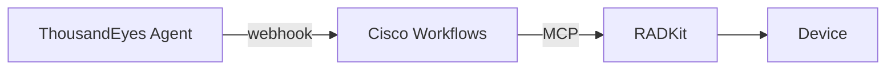
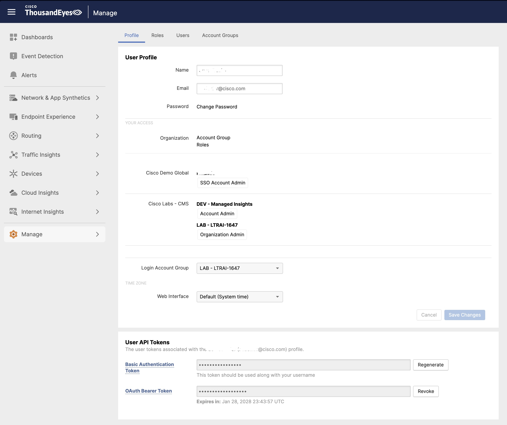

# Lab 4 - Agentic response with ThousandEyes and dynamic network path data

## Prerequisites

Before starting this lab, ensure you have completed:
- **Lab 1** - Webex bot and notification workflow (for receiving agent messages)
- **Lab 3** - AI Agent workflow, RADKit, and MCP server must be configured and working

---

## Recap

So far you have:

* Integrated a network topology's events into Cisco Workflows
* Configured deterministic automated response in Workflows
* Configured agentic operational response into Workflows
* Integrated inventory and remote access with RADKit

## Overview

In this lab, you will build on the agentic response, but instead trigger troubleshooting off an assurance event from ThousandEyes for digital user experience degrading.

By the end of this lab, you will:

- Have ThousandEyes integrated into Cisco Workflows
- Enrich the event data with network path data from ThousandEyes path info
- Observe how effective troubleshooting is with *just* an event from ThousandEyes and device access

The following diagram illustrates the event flow we are building:

---

## Step 1: Setting up ThousandEyes Agent

### 1.1 Register the agent appliance

1. Go to [https://198.18.1.202](https://198.18.1.202), accept the certificate warning, and login with <em class="example-input">admin / welcome</em>.
2. Set the new password and click <em class="button-click">change password</em>. <em class="example-input">Cisco123!</em> will work for the password policy.
3. Add account <em class="example-input">pl4okteoylmox9t60vi1ghz456ixeoa7</em> and click <em class="button-click">continue</em>.
4. Click <em class="button-click">Complete</em>. Don't worry about the Gateway not pingable and NTP server errors. They will resolve.
5. Change the <em class="lab-warning">hostname</em> to <em class="example-input">&lt;your_name&gt;-thousandeyes</em> and <em class="button-click">Save Changes</em>

### 1.2 Validate registration

1. In ThousandEyes.com, go to <em class="button-click">Network & App Synthetics > Agent Settings</em>.
2. You should see your agent in the list, under the hostname field.
3. Notice how the agent name has a random ID suffix created during registration due to everyone participating in the lab having the same OS hostname. Let's rename this agent name as well for better identification. Click the agent and change <em class="lab-warning">Agent Name</em> to be <em class="example-input">&lt;your_name&gt;-thousandeyes</em> and <em class="button-click">Save Changes</em>.

## Step 2: Configuring ThousandEyes Testing

### 2.1 Configure the HTTP Server test
1. Login to [https://www.thousandeyes.com](https://www.thousandeyes.com) and go to <em class="button-click">Network & App Synthetics > Test Settings > Add New Test > HTTP Server</em>.
2. Configure URL of <em class="example-input">https://cisco.webex.com</em>
3. Set the test name to something unique, like <em class="example-input"><your_name>_webex</em>
4. Run the test every <em class="example-input">1 minute</em>
5. <em class="button-click">Select Agents</em>. Select your Agent name <em class="example-input">&lt;your_name&gt;-thousandeyes</em>. Make sure you change the <em class="lab-warning">Default interface selection</em> to <em class="example-input">eth1 198.18.13.202</em> so the test runs out the access network across R3-R2-R1 instead of across the mgmt network. Click <em class="button-click">Close</em>.
6. Click <em class="button-click">Deploy</em>.

### 2.2 Configure an alert for the test
1. <em class="button-click">Manage > Alert Rules > Add New Alert Rule</em>
2. Set these parameters:
    - <em class="lab-warning">Alert Type:</em> <em class="example-input">Web > HTTP Server</em>
    - <em class="lab-warning">Alert Rule Name</em>: <em class="example-input">Congestion Alert</em>
    - <em class="lab-warning">Tests</em>: <em class="example-input">&lt;Select your test name from 2.1&gt;</em>
    - <em class="lab-warning">Agents</em>: <em class="example-input">&lt;Select your agent&gt;</em>
3. Change <em class="lab-warning">Alert Detection</em> to <em class="example-input">Manual</em>
4. Set the rules to:
    - <em class="lab-warning">Latency</em> >= <em class="example-input">200ms</em>
    - <em class="lab-warning">Jitter</em> >= <em class="example-input">200ms</em>
    - <em class="lab-warning">Packet Loss</em> >= <em class="example-input">5%</em>
    - <em class="lab-warning">Error</em> is present
  
   <figure markdown>
      { width="600" }
   </figure>
    
5. Stay on this screen through the next step.

!!! tip
    Adaptive alerting is a neat feature, but it requires a day to run to build normality for the anomaly detection. We don't have that much time here, so even in a world of predictive AI, we're going with old-school manual thresholds.

### 2.3 Configuring the webhook integration in Workflows

1. Now we need to create a new webhook in Workflows for our ThousandEyes event. In Meraki Dashboard, go to <em class="button-click">Automation > Rules > Webhooks > + New webhook</em>
2. Name it <em class="example-input">&lt;your_name&gt;-te</em>
3. <em class="button-click">Save</em> and then go back and view it to get the URL and save this to your local notepad for later reference.

### 2.4 Configuring the webhook integration in ThousandEyes

1. Click the <em class="button-click">Notifications</em> tab below the alert name you specified.
2. Enable <em class="lab-warning">Send emails</em> to your personal email, if desired. This is sometimes helpful to see quickly when alerts change state.
3. Under <em class="lab-warning">Integrations</em> click <em class="button-click">Manage integrations</em> and go to <em class="button-click">Integrations 2.0</em>.
4. Choose <em class="button-click">Custom Webhook</em>
5. Name the webhook <em class="example-input">&lt;your_name&gt;-wh</em>.
6. Define the target as the Cisco Workflows webhook URL you created earlier in this lab.
7. No <em class="lab-warning">Auth Type</em> is needed since the API key is in the URL, so you can leave the Auth Type as <em class="example-input">Custom</em>.
8. Click <em class="button-click">Save and assign operation</em>
9. Set <em class="lab-warning">Operation Name</em> to <em class="example-input">&lt;your_name&gt;-congestion-json</em> and choose the <em class="lab-warning">Preset Configuration</em> of <em class="example-input">Splunk</em>. We aren't sending to Splunk but the preset for Splunk is a nice simple JSON format that Cisco Workflows and our AI agent will nicely process. It should prepopulate the <em class="lab-warning">Content-Type</em> header for <em class="example-input">application/json</em> which we want.
10. Leave this browser tab open. We will run a test by clicking the <em class="button-click">test</em> button after we configure our workflow to handle ThousandEyes.

### 2.5 Create ThousandEyes API Token

The ThousandEyes workflows require an API Bearer Token to query path visualization data from the ThousandEyes API.

1. In ThousandEyes, click your <em class="lab-warning">name</em> in the top right of the screen, or go to <em class="button-click">Manage > Account Settings > Users and Roles</em>.
2. Scroll down to the <em class="lab-warning">OAuth Bearer Token</em> section.
3. Click <em class="button-click">Create</em> to generate a new token. You will need to check your email and pass the token from email back to the web browser.
4. Copy the token and save it securely - you will need this when importing the workflows.

<figure markdown>
  { width="600" }
</figure>

!!! warning
    The token is only displayed once. Make sure to copy it before closing the dialog.

### 2.6 Importing a workflow for ThousandEyes event handling
1. In Cisco Workflows, go to the Automation Workspace where the workflows are listed.
2. Add the git repo for ThousandEyes workflows like you did in Lab 3:
    - <em class="lab-warning">Display Name:</em> <em class="example-input">LTRAI-1487 - ThousandEyes</em>
    - Use the same Account Keys from Lab 3
    - <em class="lab-warning">REST API Repository:</em> <em class="example-input">api.github.com/repos/ciscomanagedservices/ciscolive26_cw_ai_agents</em>
    - <em class="lab-warning">Branch:</em> <em class="example-input">main</em>
    - <em class="lab-warning">Code Path:</em> <em class="example-input">workflows/ThousandEyes</em>
3. Click <em class="button-click">Actions > Import Workflow > From Git</em> and import the <em class="example-input">GetThousandEyesPathInfo</em> workflow.
4. When prompted for the <em class="lab-warning">te_bearer</em> variable, enter the ThousandEyes OAuth Bearer Token you created in the previous step.
5. Next, import the <em class="example-input">ThousandEyesAlertWebhook</em> workflow.

### 2.7 Configuring the trigger for the workflow

1. In Cisco Workflows, go to <em class="button-click">Automation > Rules</em>
2. Click the <em class="button-click">Automation rules</em> tab, then click <em class="button-click">+ Add automation rule</em>
3. Configure the rule:
    - <em class="lab-warning">Type:</em> <em class="example-input">Webhook rule</em>
    - <em class="lab-warning">Title:</em> <em class="example-input">&lt;your_name&gt;-te-alert</em>
    - <em class="lab-warning">Webhook:</em> Select your webhook (<em class="example-input">&lt;your_name&gt;-te</em>)
    - <em class="lab-warning">Workflow:</em> Select <em class="example-input">te_alert_webhook</em>
4. Click <em class="button-click">Save</em>

## Step 3: Create congestion on the network to generate an incident

### 3.1 Create impairment
1. Let's create impairment on R2 in the middle of the router chain. <em class="example-input">ssh cisco@198.18.1.102</em>
2. Run <em class="example-input">event manager run CONGESTION_ON</em> which triggers an applet to apply interface policing and shaping on Gig1 and Gig2 to impair the access network.

### 3.2 Validating the troubleshooting run
1. It will take a few minutes for ThousandEyes to see the result, since we have a 2 minute alert. Any one have any good stories or jokes? If not, Steve is going to play music he likes which may not be to your favor.
2. If you signed up for an email alert, you should receive it soon. Otherwise, check the <em class="lab-warning">workflow run</em> section in Cisco Workflows to validate that the workflow has started to run.
3. It should now be troubleshooting the network. This takes some time to analyze output and determine the action to take for remediation--roughly 5 minutes with current early 2026 models. To watch for progress as it troubleshoots you can click <em class="button-click">...</em> on the <em class="lab-warning">AI Agent</em> subworkflow in the webhook workflow run, and then click <em class="button-click">Update I_messages variable</em> to watch for the latest updates in realtime. You will want to change the iteration in the main <em class="lab-warning">Agent Iteration Loop</em> to the last or second to last iteration (sometimes the last iteration is still processing and won't have content).
4. Alternatively, you can just wait for Webex Teams summary messages at milestones.
5. Eventually you should see it request a task to be approved. Go to <em class="button-click">Automation > User Tasks</em> to see if it is requesting a task approval. If it needs more info from you, it may also request something in <em class="lab-warning">Prompts</em> but for this use case we don't expect it to need a prompt as it should have all the info it needs from ThousandEyes + RADKit to identify what it needs to solve the issue.
6. Once you see the change request, take a look at it. You should see a well curated explanation of the symptom, isolation to the root cause, and suggested fix if the change is approved. It even qualifies the risk of the change.
7. Click <em class="button-click">Approve</em>. It will take a few more minutes, but then the policy should be removed and ThousandEyes alert should clear.
8. The agent may keep assessing. We often see that after the fix it analyzes like a Problem Manager would, to determine how to prevent this issue from ever occurring again. See if you see that and a second change request.

---

## Summary

That's it--great job!

You have successfully configured:

| Component | Status | Purpose |
|-----------|--------|---------|
| ThousandEyes | Connected | Detects network performance degradation and triggers alerts |
| Cisco Workflows | Automated response | Now performing automated actions on devices |
| RADKit | Integrated | Provides secure device access for troubleshooting |

And with that, you have seen event stimulus to drive agentic network troubleshooting, all the way through root cause resolution.

Now--imagine the power of it having the ThousandEyes alert, network path, and access to device level events/logs. What other types of your network issues do you think you can use Cisco workflows ambient agent to solve for you?

## Take home ideas

We encourage you to continue to test and enhance the power of agentic troubleshooting at home. Some other things to consider trying are:

* What tool would you build? Try to build another tool and integrate it into the AI agent. See the `scripts/tools/convert_toolbox_to_openai_tools.py`
* Integrating both device event/log data and observability event data from ThousandEyes, Splunk, AppDynamics, or other tools
* Integrate your knowledge base to augment and refine specific policies or processes
* Integrate with your enterprise ITSM change management, such as ServiceNow
