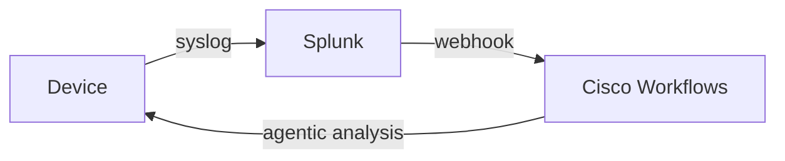

# Overview

Welcome to the **Agentic Operations with Cisco Workflows** lab for Cisco Live.

## Introduction

We will be using a virtual network topology in Cisco dCloud that generates events from Cisco infrastructure devices, through Splunk, and into Cisco Workflows. We'll also look at how we can use agents to troubleshoot from alerts from user experience tests such as with ThousandEyes.

### What is Agentic Operations?

Agentic Operations represents a paradigm shift in network management where AI-powered agents autonomously detect, analyze, and respond to network events without human intervention.

With workflow orchestration and integrations to your infrastructure and intelligent AI agents, you can start to leverage automation for fully closed-loop monitoring and response of infrastructure faults.

## Learning Objectives

This lab will give you an introduction to:

- **Event-Driven Automation** - Configuring systems to react to network events in real-time, instead of waiting for humans to pick up tickets or respond to reports of issues.
- **Cisco Workflows** - Building automation workflows that integrate with network infrastructure
- **AI-Powered Agents** - Leveraging Large Language Models to understand context and make  intelligent network troubleshooting decisions
- **Closed-Loop Remediation** - Implementing autonomous detection, analysis, response, remediation, and/or validation

By the end of this lab, you will have a solid understanding of how to build cognitive network operations agents using Cisco Workflows for AI-driven troubleshooting.

## Disclaimer

Although the lab design and configuration examples could be used as a reference, for design related questions please contact your representative at Cisco, or a Cisco partner.

## Lab Access

From your workstation, connect to the dCloud environment using the credentials provided in your lab guide.

### Quick Reference

Key IP addresses for you to reference:

| Purpose        | Access                   | username / password     |
| -------------- |--------------------------|-----------------|
| R3-mgmt        | <em class="example-input">ssh cisco@198.18.1.103</em>   | <em class="example-input">cisco / cisco</em>           |
| R2-mgmt        | <em class="example-input">ssh cisco@198.18.1.102</em>   | <em class="example-input">cisco / cisco</em>           |
| ThousandEyes   | <em class="example-input">https://198.18.1.202</em>     | <em class="example-input">admin / welcome</em> |
| Splunk         | <em class="example-input">http://198.18.1.210:8000</em> | <em class="example-input">admin / cisco</em>   |
| wf-remote      | <em class="example-input">ssh root@198.18.1.204</em>    | <em class="example-input">root / cisco</em>           |
| jumphost       | <em class="example-input">ssh root@198.18.1.200</em>    | <em class="example-input">root / cisco</em>           |
| ubuntu-server  | <em class="example-input">ssh root@198.18.1.250</em>    | <em class="example-input">root / cisco</em>           |

## Getting Started

This lab leverages Cisco dCloud for the virtual network topology. The environment generates events from Cisco infrastructure devices, through Splunk, and into Cisco Workflows.

### Components

You will encounter the following components in this lab:

* **Cisco Workflows** (in Meraki Dashboard)
* **Cisco CSR1000v** virtual routers
* **Splunk** for log aggregation and alerting
* **ThousandEyes** for user experience monitoring
* **Large Language Model** integration (GPT 5.2 or optionally Claude Sonnet/Opus 4.5)
* **Cisco CX RADKit** for remote access to Cisco infrastructure devices

### Event Flow

The event chain in this lab follows this pattern:

## Lab Flow

1. **Lab 1** - Set up the network topology for faults to be sent to Cisco Workflows and generate Webex notifications
2. **Lab 2** - Configure Cisco Workflows for automated response from the event generated in Lab 1
3. **Lab 3** - Configure the Cisco Workflows agent for cognitive agentic response instead of static automation
4. **Lab 4** - See how the agent can respond to ThousandEyes alerts on degraded user experience
5. **Lab 5** - Integrate a custom tool into the agentic workflow

